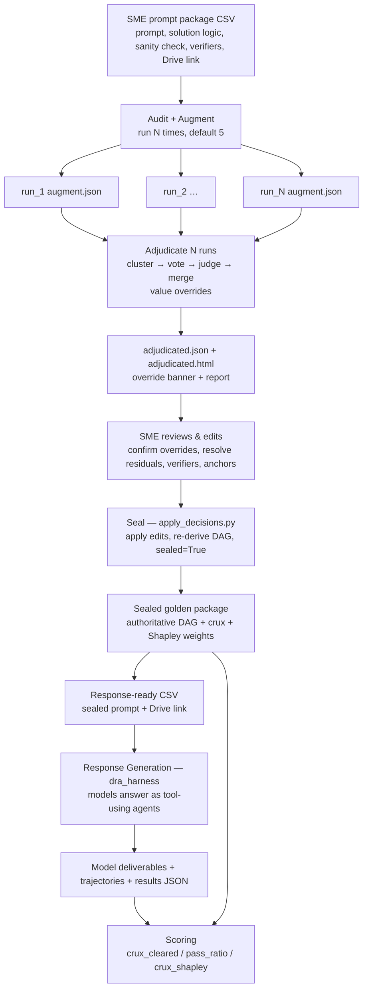

# DRA — Deep Research Agent Benchmark

End-to-end pipeline for building and running the DRA benchmark: it turns SME
prompt packages into **sealed golden packages** (corrected prompt + golden
deliverable + verifier DAG + crux set + Shapley weights), generates **model
responses** to the sealed prompts as real tool-using agents, and **scores** those
responses against the golden.

The pipeline has two halves:

- **Authoring** (`src/`, `run_augment.py`, `run_adjudicate.py`,
  `apply_decisions.py`): audit → augment (run N times) → **adjudicate the N runs**
  → SME review → seal. Produces the golden and the finalized verifier DAG.
  Multiple runs are reconciled because audit/augment are non-deterministic LLM
  calls; a single run would inherit whichever way its calls happened to fall.
- **Response generation + scoring** (`dra_harness/`, scorer): sealed prompts →
  model deliverables → verifier scores.

Detailed docs:
- **`README_audit_augment_process.md`** — the authoring side (audit/augment, the
  HTML review files, the seal).
- **`README_harness.md`** — the response-generation harness (models, MCP tools,
  web search, CLI, outputs).
- scoring README — the scorer (crux metrics, DAG-weighted VPR).

---

## 1. The complete workflow



---

## 2. Step-by-step: what each stage ingests and produces

| # | Stage | Ingests | Produces | Entry point |
|---|---|---|---|---|
| 1 | **Audit** | SME prompt package (prompt, solution logic, sanity check, verifiers) | corrected claims, finalized verifier text + frozen targets, `AuditResult` | `audit_task` (in `run_augment.py`) |
| 2 | **Augment** (×N runs, default 5) | `AuditResult` (finalized set) + Drive input files | per-run golden + DAG edges + anchors + added verifiers → `run_<k>/{task_id}_augment.json` | `run_augment.py` |
| 3 | **Adjudicate** | the N `augment.json` runs | reconciled golden (cluster→vote→judge→merge, value overrides) → `adjudicated.json` + `adjudicated.html` | `run_adjudicate.py` |
| 4 | **SME review** | `adjudicated.html` (override banner + report) | SME decisions (confirm overrides, resolve residuals, edit verifiers/anchors) | the HTML file |
| 5 | **Seal** | augment.json + SME decisions | re-derived DAG/weights/crux, `sealed=True` golden package | `apply_decisions.py` |
| 6 | **Response-ready CSV** | sealed package | CSV with sealed prompt + Drive link (columns the harness reads) | delivery tooling |
| 7 | **Response Generation** | response-ready CSV + Drive input files | per-model deliverables (`*_answer.docx`) + trajectories + results JSON | `python -m dra_harness` |
| 8 | **Scoring** | model deliverables + sealed golden/verifiers | `crux_cleared`, `crux_verifier_pass_ratio`, `crux_shapley_score` | scorer |

## 2.1 Artifact lineage (what turns into what)

The pipeline is a chain of artifacts; each stage's output is the next stage's
input. Tracing one task end to end:

```
SME prompt package (one CSV row)
  │  audit + augment, run N times (default 5)
  ▼
run_1/{task_id}_augment.json … run_N/{task_id}_augment.json   ← N independent runs
  │  adjudicate_runs.adjudicate  (cluster → vote → judge → merge)
  ▼
adjudicated.json  +  adjudicated.html                          ← reconciled, SME-facing
  │  SME reviews adjudicated.html, records decisions
  │  apply_decisions.py  (apply edits, re-derive frozen graph, seal)
  ▼
sealed golden package  (golden deliverable + finalized verifier DAG + crux + Shapley weights)
  │  delivery tooling
  ▼
response-ready CSV  (sealed prompt + Drive link, harness-consumable columns)
  │  python -m dra_harness --live --resolve-files
  ▼
runs_dir/run_<ts>_<providers>/…/  <provider>_answer.docx  +  results JSON  (trajectories, cost)
  │  scorer  (consumes sealed golden + results JSON)
  ▼
per-response scores: crux_cleared / crux_verifier_pass_ratio / crux_shapley_score
```

The three spine artifacts to know:

- **`adjudicated.json`** — the reconciled golden after N runs are merged; carries
  the full adjudication log (overrides, residual decisions, dropped minorities).
  `finalize_tasks.py` discovers the nested `{task_id}/adjudicated.json` layout.
- **response-ready CSV** — the handoff into the harness. Must carry the **sealed
  (corrected)** prompt, a Drive link, and `task_id`.
- **results JSON** (under `runs_dir/`) — the handoff into scoring: per-model
  deliverables, trajectories, tokens, cost.

> The per-run `{task_id}_augment.json` is the authoring unit; `adjudicated.json`
> is the reconciled unit; the sealed package is the authoritative unit the scorer
> grades against. Don't score an un-adjudicated single run — it inherits whichever
> way that one run's LLM calls happened to fall.

---

## 3. The prompt package

A prompt package (one CSV row) is the unit of work. Key columns:

| Column | Role |
|---|---|
| `task_id` | stable id, shared across all stages and providers |
| `Prompt` | the task prompt (the sealed/corrected version feeds response gen) |
| `Solution Logic` | the problem-solving procedure / answer key (audit input) |
| `Sanity Check` | the Lazy-AI trap description (drives anchors) |
| `Verifiers` | the binary checks (audited, finalized, weighted) |
| `Drive Link` | Google Drive folder with the task's input files |

> **Corrected vs original prompt.** The harness generates against whatever is in
> the `Prompt` column. For a valid run this must be the **sealed/corrected**
> prompt, or responses won't match the verifiers. A "slim" SME CSV may carry only
> the original prompt — confirm it is the corrected version before generating.

---

## 4. Repo layout

```
.
├── src/                     # authoring: auditor, augment, verifier audit, crux/Shapley
│   ├── auditor.py           #   Call 1/2 auditor + verifier finalization (1b)
│   ├── augment_task.py      #   audit → augment → DAG → crux → Shapley
│   ├── verifier_audit.py    #   property audit, splits, temporal screen
│   ├── crux_shapley.py      #   select_crux, crux_shapley, score_crux
│   └── verifier_weights.py  #   base weights
├── run_augment.py           # authoring CLI  → augment.json + HTML + augmented CSV
├── apply_decisions.py       # seal: apply SME edits, re-derive DAG, sealed=True
├── dra_harness/             # response generation
│   ├── provider.py          #   model registry + one OpenAI-compatible driver
│   ├── runner.py            #   ReAct loop, message build, output harvest
│   ├── tools.py             #   9 local MCP tools (Serper web_search, etc.)
│   ├── exec_server.py       #   FastMCP tool server (stdio)
│   ├── mcp_client.py        #   launches exec_server, tool discovery
│   ├── pipeline.py          #   fan-out, aggregate, results JSON
│   ├── config.py            #   PipelineConfig / GenParams / agent_overrides
│   ├── csv_loader.py        #   response-ready CSV → PromptPackage
│   └── file_resolver.py     #   Drive folder/file → local staging
├── DATAFLOW.md              # harness data-flow reference
├── README_harness.md        # harness detail
├── README_audit_augment_process.md   # authoring detail
└── runs_dir/                # response-gen outputs (per-run, timestamped)
```

---

## 5. Requirements

```bash
# environments: Mac = conda env `dra` (py3.11); spark server = conda env `adobe` (py3.10)

# authoring
pip install python-docx openpyxl PyMuPDF python-dotenv --break-system-packages
# response generation (adds)
pip install openai fastmcp duckduckgo-search pdfplumber requests --break-system-packages
```

`.env` at repo root:

```
OPENROUTER_API_KEY=...   # all response-gen models (and the augment model if via OpenRouter)
ANTHROPIC_API_KEY=...    # augment (Opus) if called directly
SERPER_API_KEY=...       # harness web_search (Serper primary; DuckDuckGo fallback)
COMETAPI_KEY=...          # only for the doubao reference model
```

---

## 6. How to start

### Authoring (build the golden)

```bash
# augment one row, with its HTML review files
python run_augment.py --csv prompt_data.csv --row 1

# review output/augmented/{task_id}_augment.html and _golden.html (SME)
# then seal:
python apply_decisions.py ...    # applies SME decisions, re-derives, seals
```

See `README_audit_augment_process.md`.

### Response generation (run the models)

```bash
# 0. smoke-test models + tools first (cheap)
python test_models.py --all
python test_harness_tools.py opus5

# 1. dry run (free) — confirm CSV loads and Drive files resolve to staging
python -m dra_harness --csv ./SME_data/<file>.csv --task-ids <id> \
  --providers opus5 gemini31_pro gpt56_sol qwen27b --resolve-files --verbose

# 2. live (real calls) — add a cost ceiling; inspect deliverables before scaling
python -m dra_harness --csv ./SME_data/<file>.csv --task-ids <id> \
  --providers opus5 gemini31_pro gpt56_sol qwen27b \
  --live --resolve-files --max-cost 40 --verbose
```

See `README_harness.md`.

> Two load-bearing flags for a real run: **`--live`** (else it's a dry run) and
> **`--resolve-files`** (else models generate blind without the input files).
> Leave **`--web-search` off** — the local Serper `web_search` tool already gives
> every model web search, and the OpenRouter plugin collides with it on some
> providers.

---

## 7. Model set (response generation)

Validated candidate models: `opus5`, `gpt56_sol`, `gemini31_pro`, `grok46`,
`gpt56_terra`, `sonnet`, `deepseek_v4_flash`, `kimi_k3`, `glm52`, **`qwen27b`**.
Reference (golden) models, run separately: `hunyuan`, `doubao`.

> Use `qwen27b` (`qwen/qwen3.6-27b`), **not** the `qwen3.6-35b-a3b` variant —
> the a3b MoE variant fabricates answers and doesn't call tools. Keep `qwen27b`
> at temperature 0.3. Full registry and rationale in `README_harness.md`.

---

## 8. Next step

Scoring is documented separately. It consumes the sealed golden package
(`{task_id}_augment.json` / sealed verifiers) plus the harness results JSON, and
computes the three co-equal crux metrics (`crux_cleared`,
`crux_verifier_pass_ratio`, `crux_shapley_score`) per response.