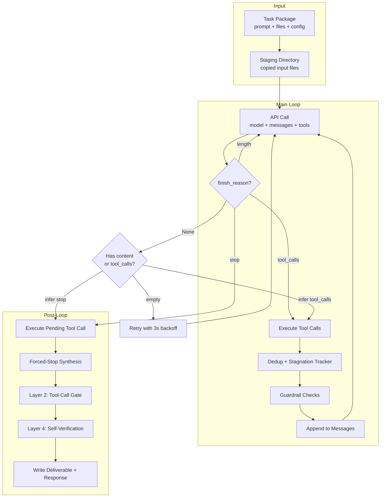
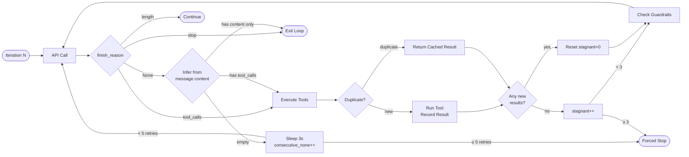
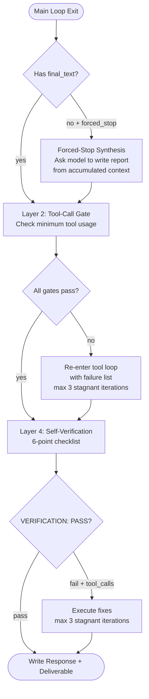
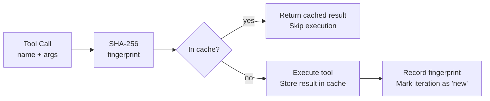

# Qwen DRA Pipeline — Technical Documentation

## Overview

The Qwen Deep Research Agent (DRA) adapter orchestrates multi-step agentic research using the Qwen 3.6/3.7 model family via OpenRouter. It manages an iterative tool-calling loop with built-in guardrails, deduplication, stagnation detection, and multi-layer verification.

**Models supported:**
- `qwen/qwen3.6-27b` — Open-weight 27B (Alibaba provider pinning recommended)
- `qwen/qwen3.7-max` — Closed-weight frontier (Alibaba-only routing)

**Vision model:** `qwen/qwen3.6-plus` for `read_file_visual` calls on images and complex PDFs.

---

## Architecture



---

## Main Loop Mechanics

### Iteration Flow



### finish_reason Handling

| finish_reason | Action | Notes |
|---|---|---|
| `tool_calls` | Execute tools, continue loop | Normal flow |
| `stop` | Exit loop with final text | Model considers task complete |
| `None` (with tool_calls) | Treat as `tool_calls` | Provider didn't set flag |
| `None` (with content) | Treat as `stop` | Provider didn't set flag |
| `None` (empty) | Retry with 3s backoff, cap at 5 | Provider returned blank |
| `length` | Continue loop (model hit max_tokens) | Response truncated |

---

## Guardrails

### Overview

```mermaid
flowchart TB
    subgraph "Pre-Loop Guards"
        G_MAX[Max Tool Rounds<br>default=100]
        G_BUDGET[Cost Budget<br>task.max_cost_usd]
        G_TIMEOUT[Timeout<br>task.timeout_seconds]
    end

    subgraph "In-Loop Guards"
        G1[Guard 1: Search Loop Cap<br>8 consecutive web-only iterations]
        G7[Guard 7: Progress Gate<br>No python_execute by iter 20]
        G8[Guard 8: File Read Check<br>Not all files read by iter 5]
    end

    subgraph "Automatic Recovery"
        G_NONE[Empty Response Handler<br>5 consecutive None → forced stop]
        G_MALFORM[Malformed Args Handler<br>2 retries with nudge]
        G_STAGNANT[Stagnation Detector<br>3 consecutive unproductive iters]
        G_PENDING[Pending Tool Executor<br>Mid-call tool_call in raw text]
    end

    G_MAX --> |exceeded| FORCED_STOP([Forced Stop])
    G_BUDGET --> |exceeded| FORCED_STOP
    G_TIMEOUT --> |exceeded| FORCED_STOP
    G1 --> |fires| NUDGE1[Inject: proceed with available data]
    G7 --> |fires| NUDGE7[Inject: start calculations now]
    G8 --> |fires| NUDGE8[Inject: read remaining files]
    G_NONE --> |5 empty| FORCED_STOP
    G_MALFORM --> |3rd failure| FORCED_STOP
    G_STAGNANT --> |fires| FORCED_STOP
    G_PENDING --> |found code| EXECUTE_IT[Execute the code]
```



### Guard Details

#### Guard 1: Search Loop Cap

**Problem:** Model calls `web_search`/`web_fetch` repeatedly without doing any actual work, burning iterations on queries that return blocked/empty results (e.g., Glassdoor anti-scraping).

**Trigger:** 8 consecutive iterations where the ONLY tools called are `web_search` or `web_fetch` — no `python_execute`, `write_file`, `read_file`, or other work tools.

**Action:** Inject user message: *"You have spent the last 8 iterations on web searches without performing any analysis. Proceed with the data you already have, note any gaps as limitations, and begin your calculations now."*

**Reset:** Counter resets to 0 whenever any non-web tool is called.

```python
# Tracking
web_tools = {"web_search", "web_fetch"}
if iter_tools.issubset(web_tools) and len(iter_tools) > 0:
    consecutive_web_only += 1
else:
    consecutive_web_only = 0

# Trigger
if consecutive_web_only >= 8:
    messages.append({"role": "user", "content": "..."})
    consecutive_web_only = 0
```

**Evidence:** In the failed MediForm run, the model spent 30+ consecutive iterations searching for Glassdoor salary data. This guard would have fired at iteration 12, saving 23 wasted iterations.

---

#### Guard 7: Progress Gate (Iteration 20)

**Problem:** Model spends all iterations on research (web search, file reading) without ever starting calculations. Task times out with no analysis done.

**Trigger:** `python_execute` has not been called by iteration 20.

**Action:** Inject user message: *"You are 20 iterations in and have not performed any calculations yet. Stop researching and begin your analysis now using python_execute."*

**One-shot:** Fires once at exactly iteration 20.

```python
if iterations == 20 and not has_python_execute:
    messages.append({"role": "user", "content": "..."})
```

**Evidence:** In the failed SkyRoute run (53 iterations, 107 tool calls), zero `python_execute` was called. The model spent the entire run trying to fetch FRED PPI data. This guard would have forced it to start calculations at iteration 20.

---

#### Guard 8: File Read Check (Iteration 5)

**Problem:** Model jumps into web research before reading all input files, missing critical data that would make web searches unnecessary.

**Trigger:** Not all input files have been read by iteration 5 (tracked by filename from `read_file`/`read_file_visual`/`search_in_file` calls).

**Action:** Inject user message: *"REMINDER: You have not yet read these input files: [list]. Read them before continuing."*

**One-shot:** Fires once at exactly iteration 5.

```python
if iterations == 5 and len(task.file_paths) > 0:
    expected = {os.path.basename(f) for f in task.file_paths}
    unread = expected - files_read
    if unread:
        messages.append({"role": "user", "content": f"...{unread}..."})
```

---

#### Empty Response Handler (consecutive_none)

**Problem:** Provider returns empty responses with `finish_reason=None` — no content, no tool calls, no tokens. This happens when the provider's tool call parser fails to recognize the model's output format.

**Root cause:** OpenRouter routes to multiple providers. Some providers can't parse Qwen's tool call format (requires `--tool-call-parser qwen3_coder` in vLLM). Alibaba (who built the model) parses correctly; others may not.

**Mechanism:**
1. If `finish_reason=None` but message has `tool_calls` → treat as `tool_calls`
2. If `finish_reason=None` but message has `content` → treat as `stop`  
3. If `finish_reason=None` with nothing → increment counter, sleep 3s, retry
4. After 5 consecutive empty responses → forced stop

**Fix:** Set `QWEN_PROVIDER=alibaba` in `.env` to pin to Alibaba's infrastructure.

---

#### Malformed Arguments Handler

**Problem:** Model generates tool call with invalid JSON arguments.

**Mechanism:** Catch the API error, inject a nudge telling the model to fix its JSON, retry up to 2 times.

---

#### Stagnation Detector

**Problem:** Model keeps calling tools but produces no new information — same queries, same results, spinning in circles.

**Mechanism:** The `_ToolTracker` fingerprints each tool call (name + arguments hash). If 3 consecutive iterations produce zero new fingerprints, the loop is stagnant.

**Action:** Forced stop → synthesis.

---

#### Pending Tool Call Executor

**Problem:** Model was mid-tool-call when the loop ended (e.g., generated `<tool_call>` XML with python code but the iteration limit hit before execution).

**Mechanism:** After the main loop exits, scan the last message for raw `<tool_call>` XML containing `python_execute` code. If found, extract and execute it.

```python
tc_match = re.search(r"<tool_call>\s*(\{.*?\})\s*</tool_call>", last_text, re.DOTALL)
if tc_match:
    tc_json = json.loads(tc_match.group(1))
    if tc_json.get("name") == "python_execute":
        exec_result = await _exec_python(tc_json["arguments"]["code"], staging_dir)
```

---

## Post-Loop Layers



### Layer 2: Dynamic Minimum Tool-Call Gate

Checks that the model actually did the minimum work before accepting the response:

| Gate | Requirement | How checked |
|---|---|---|
| File reads | `read_file` count ≥ number of input files | Count from tool_call_log |
| Code execution | ≥ 1 `python_execute` if output files required | Count from tool_call_log |
| Web search | ≥ 1 `web_search` if IAT-3 (external data task) | Count from tool_call_log |

If any gate fails, the model is told what's missing and re-enters a mini tool loop (capped at 3 stagnant iterations).

### Layer 4: Self-Verification

The model reviews its own response against a 6-point checklist:

1. Did you read ALL input files?
2. Does your response directly answer what was asked?
3. Are calculations verified with `python_execute`?
4. Are claims cited?
5. Did you generate required output files?
6. Any charts/diagrams to examine with `read_file_visual`?

If verification fails, the model can make additional tool calls to fix issues (capped at 3 stagnant iterations).

---

## Deduplication and Stagnation

### Tool Fingerprinting



Each tool call is fingerprinted as `sha256(tool_name + sorted(args))`. Duplicate calls return cached results without re-execution.

### Stagnation Detection

```
Iteration N:   2 new fingerprints  → stagnant_count = 0
Iteration N+1: 0 new fingerprints  → stagnant_count = 1
Iteration N+2: 0 new fingerprints  → stagnant_count = 2
Iteration N+3: 0 new fingerprints  → stagnant_count = 3 → STAGNANT!
```

3 consecutive iterations with zero new tool results triggers forced stop.

---

## Provider Configuration

### Environment Variables

| Variable | Default | Description |
|---|---|---|
| `QWEN_MODEL` | `qwen/qwen3.6-27b` | Main model ID on OpenRouter |
| `QWEN_VISION_MODEL` | `qwen/qwen3.6-plus` | Vision model for `read_file_visual` |
| `QWEN_API_KEY` | — | OpenRouter API key |
| `QWEN_VISION_API_KEY` | — | Vision model API key (can be same) |
| `QWEN_PROVIDER` | (none) | Pin to provider: `alibaba`, `deepinfra/fp8` |
| `QWEN_MAX_ROUNDS` | `100` | Override max_tool_rounds |

### Provider Pinning

When the model decides to call a tool, it writes the instruction in its own internal format. The hosting provider's inference engine must translate this into standard OpenAI format. OpenRouter randomly assigns each request to different providers — some translate correctly, some can't and return blank responses.

**Fix:** `QWEN_PROVIDER=alibaba` locks every request to Alibaba (who built the model). Set in `.env`:

```env
QWEN_PROVIDER=alibaba
```

**Shell trap:** `load_dotenv()` reads `.env` at startup, but shell-exported variables override it. If you previously exported `QWEN_PROVIDER`, run `unset QWEN_PROVIDER` or open a new terminal.

---

## Dispatcher Integration

The task dispatcher manages timeouts and passes configuration to the adapter:

| Setting | Value | Notes |
|---|---|---|
| Agent timeout | 3600s (1 hour) | Was 1800s, increased for vision-heavy tasks |
| Dispatcher timeout | Agent timeout + 60s | Kills process if agent doesn't return |
| Heartbeat interval | 300s | Logs "still running" every 5 minutes |

---

## Tools Available

| Tool | Description | Notes |
|---|---|---|
| `web_search` | DuckDuckGo search | Returns top results |
| `web_fetch` | Fetch URL content | Can't parse PDFs or anti-scraping sites |
| `read_file` | Read file as text | XLSX, CSV, DOCX, PDF (text layer) |
| `read_file_visual` | Rasterize + vision model | For images, charts, scanned PDFs, complex PPTX |
| `python_execute` | Run Python code | pandas, numpy, scipy, openpyxl available |
| `write_file` | Write output file | DOCX, XLSX, PPTX, PDF, MD, CSV |
| `list_directory` | List staging directory | Shows available input files |
| `search_in_file` | Grep within a file | Keyword search |

---

## Failure Modes and Mitigations

| Failure Mode | Symptom | Mitigation |
|---|---|---|
| Provider tool-call parsing | `finish_reason=None`, empty response | Provider pinning (`QWEN_PROVIDER=alibaba`) |
| Search loop | 30+ web calls, no progress | Guard 1: 8 consecutive web-only → nudge |
| Research without analysis | 50+ iterations, 0 `python_execute` | Guard 7: nudge at iteration 20 |
| Unread input files | Model starts web research before reading files | Guard 8: reminder at iteration 5 |
| Stagnation | Same tool calls repeated | Dedup cache + 3-iteration stagnation detector |
| Timeout | Vision calls + large outputs = slow iterations | Increased timeout to 3600s |
| PPTX false-positive visual | All PPTX tagged `[VISUAL]`, wasting 60s/file on vision API | `has_visual_content()` now checks for actual images |
| Malformed JSON args | Provider returns garbled tool arguments | 2-retry handler with nudge |
| Mid-call interruption | Model generating code when iteration limit hits | Pending tool call executor |

---

## Typical Run Profile

A successful task run on Qwen 3.6 27B typically:

- **Iterations:** 15–35
- **Tool calls:** 30–80
- **Duration:** 10–25 minutes
- **Input tokens:** 1–3M (grows with context)
- **Output tokens:** 10–30K
- **Cost:** $0.002–0.005 (OpenRouter pricing)

A failed run shows:
- 50+ iterations (hit stagnation or timeout)
- 100+ tool calls (spinning on web search)
- 0 `python_execute` calls (never started analysis)
- `finish_reason=None` entries (provider failures)
