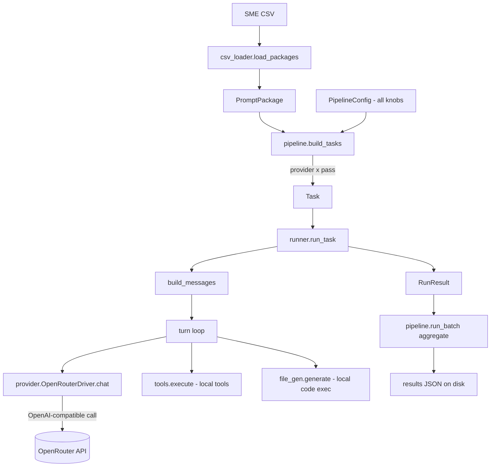

# Data Flow — `indrayudh_pipeline` (worked example + all scenarios)

This document traces ONE real CSV row through every component of the pipeline,
showing the exact shape of data entering and leaving each block, then enumerates
every case scenario (dry-run, web search, tools, file output, failures, budget
guards, multi-provider/pass, etc.).

---

## 1. The diagram



Component-to-file map:

| Block | Code |
|---|---|
| `load_packages` | [csv_loader.py](csv_loader.py) |
| `build_tasks` / `run_batch` | [pipeline.py](pipeline.py) |
| `PipelineConfig` / `GenParams` | [config.py](config.py) |
| `Task` / `RunResult` | [models.py](models.py) |
| `run_task` / `build_messages` | [runner.py](runner.py) |
| `OpenRouterDriver.chat` | [provider.py](provider.py) |
| local tools | [tools.py](tools.py) |
| file creation | [file_gen.py](file_gen.py) |

---

## 2. The example input

We use **row 1** of `imp_files/orig_common_plus_approved.csv`:

| Column | Value |
|---|---|
| `task_id` | `tsk_1874355798` |
| `Name` | `Harsh` |
| `Prompt` | "A 350-bed multispecialty hospital in North India has seen a sharp rise in patient complaints related to long morning OPD waits... The COO needs a recommendation within one week on whether the hospital can fix the issue through process redesign alone or whether it must add permanent front-end staffing..." |
| `Drive Link` | `https://drive.google.com/drive/folders/13n8qgZjkiljSZuKfEX8056WnKgLn48WL` |

Run config for the walk-through:

```python
PipelineConfig(
    providers=["claude", "qwen"],   # 2 providers
    passes_per_provider=1,
    dry_run=False,                  # live
    resolve_files=False,            # keep the Drive URL, do not download
    defaults=GenParams(web_search=True, max_turns=6, file_output=True),
)
```

---

## 3. Block-by-block, with expected results

### Block A — `csv_loader.load_packages(csv)`

**In:** path to the CSV.
**Does:** alias-maps the 3 columns (`id`, `prompt`, `file link`), normalizes ids,
auto-detects output formats from the prompt text, optionally resolves Drive files.
**Out:** a list of `PromptPackage`. For our row:

```python
PromptPackage(
    task_id="tsk_1874355798",
    prompt="A 350-bed multispecialty hospital ...",
    file_paths=["https://drive.google.com/drive/folders/13n8qgZjkiljSZuKfEX8056WnKgLn48WL"],
    output_formats=[],          # detect_output_formats found no "excel/word/ppt" ask
    drive_url="https://drive.google.com/drive/folders/13n8qgZjkiljSZuKfEX8056WnKgLn48WL",
    sme_name="Harsh",
)
```

Note: with `resolve_files=False`, `file_paths` holds the raw Drive URL (a
reference). With `resolve_files=True`, it would instead be local paths like
`["./staging/<id>/opd_data.xlsx", ...]` after download.

### Block B — `pipeline.build_tasks(packages, cfg)`

**In:** the `PromptPackage` list + config.
**Does:** fans each package out to `providers x passes`. With 1 package, 2
providers, 1 pass → **2 Tasks**.
**Out:**

```python
Task(task_id="tsk_1874355798", provider="claude",
     model_slug="anthropic/claude-3.7-sonnet", pass_index=1,
     prompt="A 350-bed ...", file_paths=[<drive url>], output_formats=[],
     output_dir="./results/files/tsk_1874355798")
# run_id -> "tsk_1874355798__claude__p1"

Task(task_id="tsk_1874355798", provider="qwen",
     model_slug="qwen/qwen-2.5-72b-instruct", pass_index=1, ...)
# run_id -> "tsk_1874355798__qwen__p1"
```

The slug comes from `MODEL_REGISTRY` (or `cfg.model_overrides`). Each provider
also gets its **effective `GenParams`** via `cfg.params_for(provider)` (base
defaults + any `agent_overrides`).

### Block C — `runner.build_messages(task, params)`

**In:** one `Task` + its `GenParams`.
**Does:** builds the chat messages, inlining file text and (if needed) file-gen
instructions.
**Out:** an OpenAI-style message list:

```python
[
  {"role": "system", "content": "You are a deep research analyst. ..."},
  {"role": "user",   "content":
      "A 350-bed multispecialty hospital ...\n"
      "============================================================\n"
      "PROVIDED REFERENCE DOCUMENTS\n"
      # if resolve_files=True, each file's extracted text appears here;
      # with the raw URL, there is no local text to inline.
      "..."},
]
```

If `output_formats` were non-empty (e.g. `["xlsx"]`), a
`FILE GENERATION REQUIREMENT` block is appended instructing the model to emit a
sentinel-wrapped Python block.

### Block D — the turn loop (`runner.run_task`)

The loop runs up to `params.max_turns` (6). Each turn calls the driver; if the
model returns tool calls (and tools are enabled), they are executed locally and
fed back; otherwise the turn's text is the final answer.

For this example (web search on, no local tools enabled), the typical path is
**one turn**:

1. `driver.chat(...)` → model researches via OpenRouter's web plugin, returns
   the report text + citations. No `tool_calls` → loop breaks.

### Block E — `provider.OpenRouterDriver.chat(...)`

**In:** slug, messages, `GenParams`, optional tool schemas.
**Does:** one OpenAI-compatible call to `https://openrouter.ai/api/v1`. Applies
web search (`plugins:[{id:"web",max_results:5}]`), asks for cost
(`usage.include=true`), retries transient errors up to `max_retries`.
**Out:** a normalized `ChatResponse`:

```python
ChatResponse(
    text="# Executive Summary\n... recommendation: process redesign first ...",
    tool_calls=[],                       # no LOCAL tool calls (web is server-side)
    assistant_message={...},             # used only if tool calls happen
    citations=[{"url":"https://...", "title":"OPD throughput study", "snippet":""}],
    input_tokens=5120, output_tokens=1850,
    cost_usd=0.0277,                     # reported by OpenRouter
    finish_reason="stop",
)
```

### Block F — `tools.execute(...)` (only when local tools are enabled)

Not used in this example (`enabled_tools=[]`). If e.g.
`enabled_tools=["calculator"]` and the model called it:

```
tool call:  calculator{"expression": "350 * 0.12"}
result:     "42.0"   →  appended as a {"role":"tool", ...} message; loop continues
```

### Block G — `file_gen.generate(...)` (only when a file is required)

Skipped here because `output_formats=[]`. For a row whose prompt says
"present the staffing model as an Excel file" (`output_formats=["xlsx"]`):

1. Extract the Python block from the final report.
2. Run it locally in the staging dir (`subprocess`, timeout `code_exec_timeout`).
3. On success → move `output.xlsx` → `./results/files/<id>/claude_<run_id>.xlsx`.
4. On failure → send the traceback back to the model, retry up to
   `file_fix_attempts` (3) times.

**Out:** `(["./results/files/.../claude_..._p1.xlsx"], {}, fix_cost)`.

### Block H — `RunResult` (per provider+pass)

The runner assembles the normalized result. For the Claude run:

```python
RunResult(
    task_id="tsk_1874355798", run_id="tsk_1874355798__claude__p1",
    provider="claude", model="anthropic/claude-3.7-sonnet", pass_index=1,
    response_text="# Executive Summary\n...",
    citations=[{...}], output_files=[], output_file_errors={}, tool_calls=[],
    input_tokens=5120, output_tokens=1850, total_cost_usd=0.0277,
    turns=1, completed=True, forced_stop=False, error=None,
    total_duration_sec=23.4, started_at="...", completed_at="...",
)
```

### Block I — `pipeline.run_batch` aggregation + `save_results`

Gathers all `RunResult`s (here 2), computes a summary, returns one dict and
writes it to `./results/results_<timestamp>.json`:

```json
{
  "csv": "imp_files/orig_common_plus_approved.csv",
  "duration_sec": 25.1,
  "config": { "providers": ["claude","qwen"], "...": "..." },
  "summary": {
    "total_runs": 2, "succeeded": 2, "failed": 0, "total_cost_usd": 0.0461,
    "by_provider": {
      "claude": {"runs":1,"succeeded":1,"cost":0.0277},
      "qwen":   {"runs":1,"succeeded":1,"cost":0.0184}
    }
  },
  "results": [ { "run_id": "tsk_1874355798__claude__p1", "...": "..." },
               { "run_id": "tsk_1874355798__qwen__p1",   "...": "..." } ]
}
```

---

## 4. End-to-end multiplicity

For a batch the run count is:

```
runs = packages  x  len(providers)  x  passes_per_provider
```

Example: 183 rows x 4 providers x 2 passes = **1464 runs**, bounded by
`max_concurrent` at a time. One run failing never affects the others
(`asyncio.gather(..., return_exceptions=True)`).

---

## 5. All case scenarios

### 5.1 Execution mode

| Scenario | Trigger | What happens |
|---|---|---|
| Dry run (default) | `dry_run=True` / no `--live` | `run_task` returns a mock `RunResult` (no API call, `cost=0`); `output_file_errors={fmt:"DRY_RUN"}` if a file was expected |
| Live | `--live` | Real OpenRouter calls; requires `OPENROUTER_API_KEY` + `pip install openai` |

### 5.2 Web search

| Scenario | Trigger | Effect in `chat()` |
|---|---|---|
| Off (default) | `web_search=False` | plain chat completion, no web plugin |
| On (plugin) | `web_search=True`, `web_method="plugins"` | adds `plugins:[{id:"web",max_results:N}]`; citations populated from annotations |
| On (suffix) | `web_search=True`, `web_method="suffix"` | model slug becomes `<slug>:online` |

### 5.3 Tool calling (local tools)

| Scenario | Trigger | Effect |
|---|---|---|
| No tools (default) | `enabled_tools=[]` | single answer turn, no tool loop |
| Tools enabled + supported | `enabled_tools=["calculator"]`, provider `supports_tools` | model may emit `tool_calls`; runner executes them, appends results, loops until a tool-free answer or `max_turns` |
| Tools enabled but unsupported | provider `supports_tools=False` in `MODEL_REGISTRY` | tools skipped with a warning; behaves like "no tools" |
| Tool raises | tool function errors | `tools.execute` returns `"[tool error] ..."`; loop continues (never crashes) |

### 5.4 File creation

| Scenario | Trigger | Result |
|---|---|---|
| No file needed | `output_formats=[]` | file-gen skipped; `output_files=[]` |
| File needed, code runs first try | prompt asks for xlsx/docx/pptx, model emits good code | file saved to `output_dir`; `output_file_errors={}` |
| File needed, no code emitted | model forgot the code block | `file_gen` requests code from the report, then executes |
| File needed, code fails | runtime error in generated code | traceback sent back; retried up to `file_fix_attempts`; on final failure → `output_file_errors[fmt]=...`, `completed=False` |
| File output disabled | `file_output=False` | file-gen skipped even if the prompt asks for a file |

### 5.5 Loop / budget guards

| Scenario | Trigger | Result |
|---|---|---|
| Normal finish | model returns text with no tool calls | `completed=True`, `forced_stop=False` |
| Max turns hit | every turn keeps calling tools | loop exits, `forced_stop=True`, last text kept, file-gen skipped |
| Budget exceeded | accumulated `cost > max_cost_usd` | loop stops, `forced_stop=True` |
| Request timeout | call exceeds `request_timeout` | transient → retried up to `max_retries`; otherwise surfaces as error |

### 5.6 Reliability / failures

| Scenario | Trigger | Result |
|---|---|---|
| Transient API error | rate limit / 5xx / timeout | retried with backoff (`max_retries`) |
| Fatal API error | bad request / 4xx | `RunResult.completed=False`, `error=<msg>`, batch continues |
| Missing API key (live) | no `OPENROUTER_API_KEY` | `OpenRouterDriver` raises a clear setup error at init |
| Unknown provider | not in `MODEL_REGISTRY` and no override | `resolve_slug` raises `ValueError` |
| Unhandled exception in a run | anything unexpected | caught in `run_batch`; recorded as a failed result, others unaffected |

### 5.7 File resolution (Drive)

| Scenario | Trigger | `file_paths` becomes |
|---|---|---|
| Reference only (default) | `resolve_files=False` | the raw Drive URL (not inlined as text) |
| Resolved | `resolve_files=True` | local downloaded paths; their text is inlined into the prompt and available on disk for file-gen |

### 5.8 Per-provider overrides

| Scenario | Config | Effect |
|---|---|---|
| Different turns per model | `agent_overrides={"qwen":{"max_turns":2}}` | only Qwen uses 2 turns |
| Different slug | `model_overrides={"qwen":"qwen/qwen3-235b-a22b"}` | Qwen runs on that slug |
| Different sampling | `agent_overrides={"claude":{"temperature":0.0}}` | only Claude is greedy |

---

## 6. Quick commands

```bash
# Dry-run 3 rows, all default providers (no cost)
python -m indrayudh_pipeline.cli --csv imp_files/orig_common_plus_approved.csv --max-rows 3

# Live, Claude + Qwen, web search, 2 turns, calculator tool
python -m indrayudh_pipeline.cli --csv prompts.csv --live \
  --providers claude qwen --web-search --max-turns 2 --tools calculator
```
