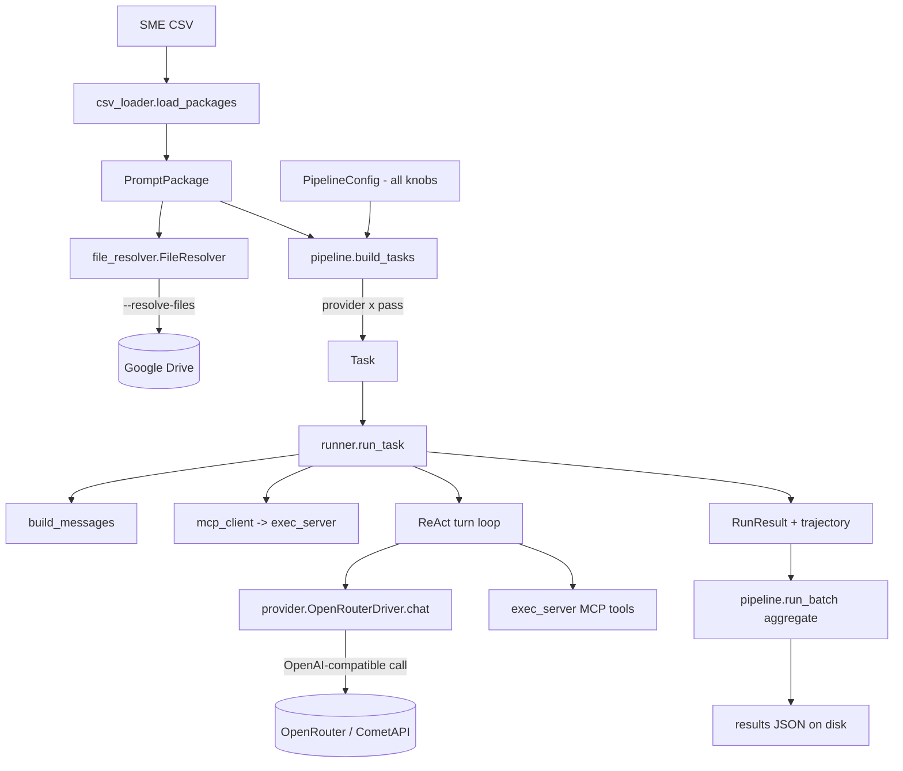

# Data Flow — `dra_harness`

This traces one CSV row through every component of the harness, showing the shape
of data entering and leaving each block, then enumerates the case scenarios
(dry-run, web search, tools, file output, failures, budget guards, multi-provider
/ multi-pass, Drive resolution, per-provider overrides).

---

## 1. The diagram



Component-to-file map:

| Block | Code |
|---|---|
| `load_packages` | `csv_loader.py` |
| `FileResolver` | `file_resolver.py` |
| `build_tasks` / `run_batch` / `save_results` | `pipeline.py` |
| `PipelineConfig` / `GenParams` | `config.py` |
| `Task` / `RunResult` | `models.py` |
| `run_task` / `build_messages` | `runner.py` |
| `OpenRouterDriver.chat` | `provider.py` |
| MCP client (stdio) | `mcp_client.py` |
| MCP tool server (FastMCP) | `exec_server.py` |
| tool implementations | `tools.py` |
| file generation helpers | `file_gen.py` |

---

## 2. The example input

Row 1 of a task CSV. The loader needs only three columns (alias-matched,
case-insensitive):

| Column | Value |
|---|---|
| `task_id` | `tsk_1874355798` |
| `Prompt` | "A 350-bed multispecialty hospital in North India has seen a sharp rise in OPD wait complaints… the COO needs a recommendation within one week on whether process redesign alone suffices or permanent front-end staffing is required…" |
| `Drive Link` | `https://drive.google.com/drive/folders/13n8qgZ…` |

Run config for the walk-through:

```python
PipelineConfig(
    providers=["claude", "qwen"],   # 2 providers
    passes_per_provider=1,
    dry_run=False,                  # live
    resolve_files=True,             # download the Drive folder to staging
    defaults=GenParams(web_search=True, max_turns=250),
)
```

---

## 3. Block-by-block, with expected results

### Block A — `csv_loader.load_packages(csv)`

**In:** path to the CSV.
**Does:** alias-maps the three columns (`id`, `prompt`, `file link`), normalizes
ids, and auto-detects an output format from the prompt text
(`output_formats` → `["xlsx"]` / `["docx"]` / `["pptx"]` / `[]`).
**Out:** a list of `PromptPackage`:

```python
PromptPackage(
    task_id="tsk_1874355798",
    prompt="A 350-bed multispecialty hospital ...",
    file_paths=["https://drive.google.com/drive/folders/13n8qgZ…"],  # raw URL until resolved
    output_formats=[],
    drive_url="https://drive.google.com/drive/folders/13n8qgZ…",
)
```

### Block A′ — `file_resolver.FileResolver` (only with `--resolve-files`)

**In:** the Drive URL from the package.
**Does:** parses the Drive reference (folder or file, any of the common URL
shapes), downloads the contents into the run's staging dir. Input files are
downloaded once and symlinked into each run folder.
**Out:** `file_paths` becomes local paths under the run's staging tree. Without
`--resolve-files`, `file_paths` keeps the raw URL and nothing is downloaded.

### Block B — `pipeline.build_tasks(packages, cfg)`

**In:** the `PromptPackage` list + config.
**Does:** fans each package out to `providers × passes`. 1 package × 2 providers
× 1 pass → **2 Tasks**. Each task's run folder is
`<staging>/<task_id>/runs/<provider>__p<pass>`.
**Out:**

```python
Task(task_id="tsk_1874355798", provider="claude",
     model_slug="anthropic/claude-sonnet-4-6", pass_index=1, ...)
# run_id -> "tsk_1874355798__claude__p1"

Task(task_id="tsk_1874355798", provider="qwen",
     model_slug="qwen/qwen3.6-27b", pass_index=1, ...)
# run_id -> "tsk_1874355798__qwen__p1"
```

The slug comes from `provider.MODEL_REGISTRY` (or a `--model` override). Each
provider gets its effective `GenParams` via `cfg.params_for(provider)` (base
defaults + any `agent_overrides` — e.g. Qwen's `temperature=0.3`).

### Block C — `runner.build_messages(task, params)`

**In:** one `Task` + its `GenParams`.
**Out:** an OpenAI-style message list (minimal system prompt + the user prompt).
With `--resolve-files`, the input files live on disk in the run folder and the
model discovers them through tools rather than having their text inlined.

### Block D — the ReAct turn loop (`runner.run_task`)

The loop runs up to `params.max_turns`. Each turn calls the driver; if the model
returns tool calls, they are executed through the MCP client and fed back;
otherwise the turn's text is the final answer. Every turn (assistant text, tool
calls, tool results, tokens, cost) is appended to the trajectory.

### Block D′ — `mcp_client` → `exec_server`

At run start the runner launches an MCP tool server (`exec_server.py`, FastMCP)
as a stdio subprocess scoped to the run's staging dir, and exposes its nine tools
to the model as OpenAI tool schemas:

`python_execute`, `bash_execute`, `read_file`, `write_file`, `list_directory`,
`search_in_file`, `web_search`, `web_fetch`, `calculator`.

### Block E — `provider.OpenRouterDriver.chat(...)`

**In:** slug, messages, `GenParams`, tool schemas.
**Does:** one OpenAI-compatible call to `https://openrouter.ai/api/v1` (or
CometAPI for Doubao). Applies OpenRouter web search when enabled, requests usage
for cost, retries transient errors up to `max_retries`.
**Out:** a normalized `ChatResponse` (text, tool_calls, citations, input/output
tokens, cost_usd, finish_reason).

### Block F — `RunResult` (per provider+pass)

The runner assembles a normalized `RunResult`: response text, citations,
`output_files`, `output_file_errors`, per-turn `trajectory`, token counts,
`total_cost_usd`, `turns`, `completed`, `forced_stop`, `error`, timings.

### Block G — `pipeline.run_batch` aggregation + `save_results`

Gathers all `RunResult`s, computes a summary (`total_runs`, `succeeded`,
`failed`, `total_cost_usd`, `by_provider`), and writes one JSON to disk.

---

## 4. Run directory layout

`run_batch` creates a single timestamped run root and puts staging under it:

```
runs_dir/
└── run_<timestamp>_<provider>/
    └── staging/
        └── tsk_1874355798/
            └── runs/
                ├── claude__p1/           # per-run workspace
                │   ├── <input files>     → symlinks to shared download
                │   └── <model outputs>   ← generated deliverables
                └── qwen__p1/
```

The results JSON is written by `save_results` as
`run_<timestamp>_<providers>_<N>tasks.json` in the output dir.

---

## 5. End-to-end multiplicity

```
runs = packages × len(providers) × passes_per_provider
```

Bounded by `max_concurrent` at a time. One run failing never affects the others
(`asyncio.gather(..., return_exceptions=True)`); the exception is caught in
`run_batch` and recorded as a failed result.

---

## 6. Case scenarios

### 6.1 Execution mode

| Scenario | Trigger | What happens |
|---|---|---|
| Dry run (default) | no `--live` | `run_task` returns a mock `RunResult` (no API call, cost 0) |
| Live | `--live` | Real OpenRouter/CometAPI calls; requires the relevant API key |

### 6.2 Web search

| Scenario | Trigger | Effect in `chat()` |
|---|---|---|
| Off (default) | `web_search=False` | plain completion, no web plugin |
| On (plugins) | `--web-search`, `web_method="plugins"` | adds `plugins:[{id:"web",max_results:N}]`; citations populated |
| On (suffix) | `web_method="suffix"` | slug becomes `<slug>:online` |

### 6.3 Local tools

| Scenario | Trigger | Effect |
|---|---|---|
| All tools (default) | `enabled_tools=["all"]` | full MCP tool set exposed |
| Subset | `--tools calculator …` | only the named tools exposed |
| Unsupported provider | `supports_tools=False` in registry | tools skipped; single-answer behavior |
| Tool raises | tool errors | error string returned to the model; loop continues |

### 6.4 File creation

| Scenario | Trigger | Result |
|---|---|---|
| No file needed | `output_formats=[]` | no file expected; `output_files=[]` |
| File asked, produced | prompt asks for xlsx/docx/pptx and the model writes it | deliverable harvested from the run folder |
| File asked, disabled | `--no-file-output` | file generation skipped |

### 6.5 Loop / budget guards

| Scenario | Trigger | Result |
|---|---|---|
| Normal finish | model returns text with no tool calls | `completed=True`, `forced_stop=False` |
| Max turns hit | loop keeps calling tools | `forced_stop=True`, last text kept |
| Budget exceeded | accumulated cost > `max_cost_usd` | loop stops, `forced_stop=True` |
| Request timeout | call exceeds `request_timeout` | transient → retried up to `max_retries` |

### 6.6 Reliability / failures

| Scenario | Trigger | Result |
|---|---|---|
| Transient API error | rate limit / 5xx / timeout | retried with backoff (`max_retries`) |
| Fatal API error | 4xx | `completed=False`, `error=<msg>`, batch continues |
| Missing API key (live) | key not set | driver raises a clear setup error at init |
| Unknown provider | not in `MODEL_REGISTRY`, no override | `resolve_slug` raises `ValueError` |
| Unhandled exception | anything unexpected | caught in `run_batch`, recorded as failed, others unaffected |

### 6.7 Drive resolution

| Scenario | Trigger | `file_paths` becomes |
|---|---|---|
| Reference only (default) | no `--resolve-files` | the raw Drive URL |
| Resolved | `--resolve-files` | local downloaded paths, symlinked into each run folder |

### 6.8 Per-provider overrides

| Scenario | Config | Effect |
|---|---|---|
| Different sampling | `agent_overrides={"qwen":{"temperature":0.3}}` (default) | only Qwen runs at 0.3 |
| Different turns | `agent_overrides={"qwen":{"max_turns":2}}` | only Qwen uses 2 turns |
| Different slug | `--model qwen=qwen/qwen3-235b-a22b` | Qwen runs on that slug |

---

## 7. Quick commands

```bash
# Dry-run 3 rows, default providers (no cost)
python -m dra_harness.cli --csv prompt_data.csv --max-rows 3

# Live, Claude + Qwen, web search, save under ./out
python -m dra_harness.cli --csv prompt_data.csv --live \
  --providers claude qwen --web-search --output-dir ./out

# Single task on Hunyuan, files resolved, verbose
python -m dra_harness --csv prompt_data.csv --live \
  --providers hunyuan --passes 1 --task-ids tsk_6177770042 \
  --resolve-files --verbose
```