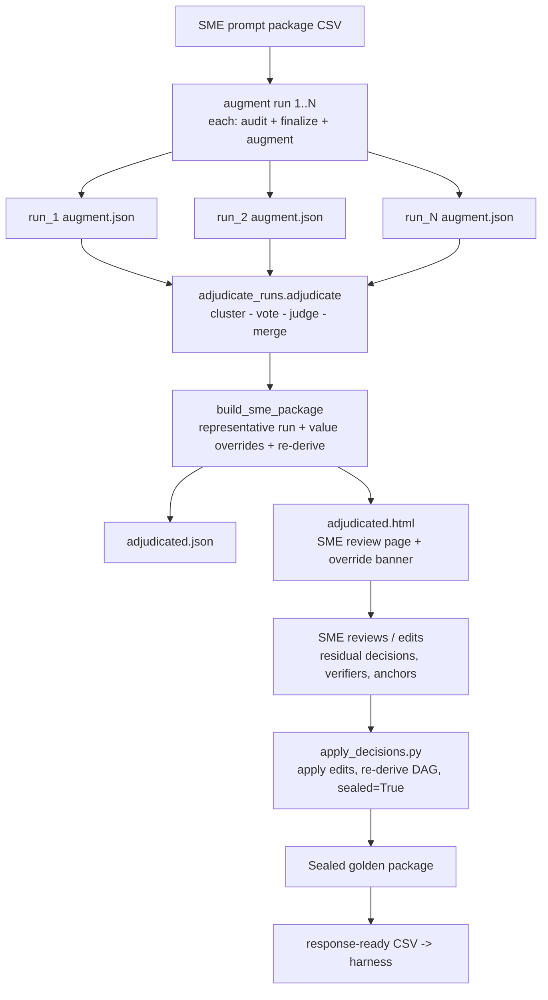

# DRA Authoring — Audit, Augment, Adjudicate, SME Review, Seal

This document covers the **authoring** side of the DRA pipeline: turning an SME
prompt package into a **sealed golden package** (golden deliverable + finalized
verifier DAG + crux set + Shapley weights). Response generation (models answering
the sealed prompt) is in `README_harness.md`; scoring is in the scoring README.

The authoring path:

```
audit → augment  (run N times, non-deterministic)
      → adjudicate the N runs into one reconciled package
      → SME reviews the adjudicated HTML
      → seal (apply SME decisions, re-derive the frozen graph)
```

The design fact that makes adjudication necessary: **audit and augment are LLM
calls and vary run to run** — 3 vs 5 claims, `V4` vs `V4a/V4b`, a trap value of 3
one run and 1 the next, a split that appears or not. Scoring a single run inherits
whichever way that run fell. So each task is run **N times (default 5, minimum
3)** and the runs are reconciled into one golden by **SELECT-AND-MERGE** —
choosing among the real alternatives the runs produced, never authoring new
content.

> Scope note: ordering/field names below are read from the actual modules
> (`adjudicate_runs.py`, `run_adjudicate.py`) plus the augment/auditor docs. The
> audit/augment internals follow the 1b design (property-audit folded into the
> auditor, golden authored over a finalized verifier set); verify exact call
> order against `src/augment_task.py`.

---

## 1. The stage in context



---

## 2. Per-run: what audit + augment produce (one `augment.json`)

Each of the N runs is a full audit->finalize->augment pass producing one
`{task_id}_augment.json`:

- **Audit** (`audit_task`): Call 1 (findings) -> arithmetic recompute (code) ->
  Call 2 (corrections). Under 1b the verifier set is **finalized inside the
  auditor**: trajectory from corrected claims, targets frozen from verifier text,
  property audit (`audit_verifiers`) applying splits/rewrites, split children
  temporal-screened at creation.
- **Augment** (one Opus call, extend-only): the golden deliverable, DAG edges,
  the two Sanity-Check anchor sets (Lazy-AI trap side + expert-path side), and any
  added verifiers. It may only ADD verifiers for uncovered gold values; it can
  never overwrite a finalized id.
- **Deterministic**: base weights, crux selection, crux-only Shapley.

Fields each run's JSON carries that the adjudicator reads:
`corrected_claim_verdicts` (with `recomputed`, `trap_value`),
`augmented_verifiers_text` (`V1: ...` lines), `verifier_splits_applied`,
`audit_verdict`, `judgment_steps`, the anchor id sets, the gold-deliverable
fields, and a `gate` block (`gate.passed`).

Because these are LLM outputs, **the N runs disagree** — which is the entire
reason for the next stage.

---

## 3. Adjudication — reconciling N runs (`adjudicate_runs.py`)

`adjudicate(run_jsons, llm_cluster, llm_judge)` reconciles the N runs into one
`final` package plus an `Adjudication` log. Four steps; two use a **master LLM**
(wired to Opus). Both LLM jobs only **SELECT/JUDGE over real run content, never
author** — enforced by a strict "you only select among options given, you never
invent" system prompt. `--no-llm` makes the whole thing deterministic (keyword
clustering + majority-wins), which is what the tests use.

**Gate handling:** runs that failed their gate (`gate.passed == False`) are kept
for **structural** votes (did a split happen? what verdict?) but **excluded from
value** votes.

### Step 1 — CLUSTER (master LLM)

Each run's claims / verifiers / trap values / judgment steps are grouped by
**conceptual ROLE** — the quantity each checks, not its wording. Different runs
phrase the same quantity differently (`"utilization with 3 clerks"` vs
`"stability check with 3 clerks"` = same role); a keyword key alone fragments ~6
real roles into ~15, so clustering is **semantic**, done once by the LLM. The LLM
only assigns existing items to groups; it writes no text.

**Deterministic safety net (`_value_postmerge`):** two clusters carrying the same
computed value — and NOT co-occurring in the same run — are merged (the clusterer
split one role under two names). The co-occurrence guard prevents merging two
genuinely different quantities that happen to share a value in one run. A keyword
fallback (`_keyword_role`) is used if the LLM is off or returns an incomplete
mapping.

### Step 2 — VOTE within each cluster (deterministic)

The modal value/text wins; the tally is recorded. **Majority = >= floor(N/2)+1**
agreeing. A cluster present in **fewer than a majority of runs** is dropped as
minority (logged in `dropped_minority`) and never enters the golden.

### Step 3 — ADJUDICATE VALUES (master LLM, can OVERRIDE majority)

The crucial step. **Majority does not judge correctness** — if the model repeats
a mistake in most runs, majority *entrenches* it (documented example: 2 runs say
`wait = 38`, 1 says `42`; `38` is the planted error, so majority is wrong). For
each value, `_judge_value` shows the LLM the derivation context and the vote, and
it **may override the majority**. The LLM must pick **from the menu** (the tally
keys); an off-menu answer is rejected and falls back to majority, logged as a
`residual_decision`. Outcomes:

- **Override** (LLM beat majority) -> `adj.overrides` (with reason), shown in JSON
  and HTML.
- **Confirm** (LLM agreed) -> `majority_decisions` with `llm_confirmed: true`.
- **No LLM / off-menu / no majority** -> `residual_decisions` (majority fallback,
  flagged for the SME).

Verifier text routing: if phrasings differ only in **wording** (same numbers),
`_judge_text` picks the clearest phrasing from the list; if they carry a
**differing embedded number** (`"wait = 38"` vs `"= 42"`), it's treated as a value
question and routed through `_judge_value` (which can override), then the phrasing
whose number matches the adjudicated value is kept. This stops the adjudicator
entrenching a wrong number hidden inside the modal phrasing.

### Step 4 — MERGE + EMIT

Winning items assembled into `final`: reconciled `corrected_claim_verdicts`,
re-ided `augmented_verifiers_text` (`V1..Vn`), `adjudicated_trap_values`, majority
`audit_verdict`, reconciled `judgment_steps`, and fresh `expected_values`
re-derived from the merged verifier text (the runs' own expected_values key on old
ids like `V4a` and would be dropped). The full `Adjudication` log is attached as
`final["adjudication"]`.

---

## 4. Building the SME package (`build_sme_package` — "Option A1")

A subtlety: a verifier **DAG only exists** relative to the specific claims its
verifiers were derived against. The *merged* verifier set comes from many runs and
has no single claim graph — overlaying it flattens the DAG. So `build_sme_package`
uses **Option A1**:

1. **Pick a representative run** (`_pick_representative`) — ranked by gate passed,
   scoreable, has a DAG, crux size, then claim+judgment count. Its trajectory,
   claims, verifiers, and DAG are the **coherent skeleton**.
2. **Apply only the adjudicated value overrides** on top — a claim that read `38`
   becomes `42` (`_apply_overrides_to_claims`), and where that number appears in
   the representative's verifier text it's replaced too
   (`_apply_overrides_to_verifier_text`) — so the trajectory the SME reads carries
   the corrected figures while keeping its DAG position.
3. **Overlay the majority verdict.**
4. **Re-derive the frozen graph** (`derive_frozen_graph(pkg, compute_shapley=True)`)
   so DAG / weights / crux / Shapley are rebuilt from the corrected package.

> Anchor-key gotcha (handled in code): persisted runs store anchors under the
> OUTPUT keys (`crux_anchors_trap` / `crux_anchors_expert`), but
> `derive_frozen_graph` reads the INPUT keys (`trap_anchor_ids` /
> `expert_anchor_ids`). `build_sme_package` maps them back — otherwise the
> re-derivation gets no anchors and `select_crux` collapses the crux to just the
> final-answer verifier(s), turning a 4-verifier crux into 1.

The merged verifier set and every override are still recorded in the package
(`adjudicated_verifier_set`, `adjudicated_trap_values`, `_adjudication`) and shown
in the HTML banner — nothing is hidden even though the *skeleton* is one run.

---

## 5. Intermediate & final files

### Per run (N of them)

| File | What it is |
|---|---|
| `run_<k>/{task_id}_augment.json` | one run's full `AugmentResult` |
| `run_<k>/{task_id}_augment.html` | that run's own augment report (optional) |

### Adjudicated (SME-facing)

| File | What it is | Produced by |
|---|---|---|
| `adjudicated.json` | Assembled SME package: representative run + value overrides + re-derived graph + full adjudication log | `build_sme_package` |
| `adjudicated.html` | The **SME review page** — same shape as a per-run augment report, with an **override banner** prepended | `render_html` |

`adjudicated.json` and `.html` are built from the **same `pkg` object**, so they
always agree. The nested `{task_id}/adjudicated.json` layout is what
`finalize_tasks.py` discovers downstream.

### The `Adjudication` log (inside `adjudicated.json`)

`n_runs`, `gate_ok_runs`, `clustering_method` (`llm` / `keyword_fallback`),
`claim_clusters`, `verifier_clusters`, `majority_decisions`, **`overrides`** (LLM
beat majority — tally + reason), `residual_decisions` (majority-fallback /
off-menu-rejected — flagged for SME), `dropped_minority` (roles in too few runs),
`notes`.

---

## 6. The adjudicated HTML — sections and how the SME fills it

The adjudicated HTML is the standard augment report with an **override banner** at
the top.

### Sections

1. **Override banner** (top) — how many runs, which passed the gate, the
   clustering method; a red-highlighted list of every **value override** (role,
   majority-by-count value, chosen value, tally, adjudicator's reason); and any
   **dropped minority** roles. If no overrides, it says majority and adjudicator
   agreed. This is the SME's summary of where automated reconciliation made a
   non-obvious call.
2. **Corrections / changes** — audit corrections (mechanical + judgment-pending)
   from the representative run.
3. **Verifier set** — the representative run's verifiers (coherent with the DAG),
   adjudicated values applied; each with expected value, kind
   (numeric/decision/string), source_of_verification.
4. **DAG** — the dependency graph (intact, from the representative run).
5. **Sanity-Check anchors** — trap side + expert side (drive crux selection).

### How the SME acts on it

1. **Read the override banner first** — the automated non-majority calls; confirm
   each override's reasoning, and check `residual_decisions` (where the system
   fell back to majority with no clear answer — these most need a human).
2. **Review each verifier** — value, atomicity, target; edit, revert a split, or
   flag.
3. **Confirm anchors and DAG.**
4. **Escalate task-author adjudications** — genuinely disputed calls needing the
   task author, not the SME (e.g. an inverted covenant-trigger direction, a
   ticker-convention question). Tracked in handoff notes as `unresolved_issues`;
   they flip verifier polarity across multiple artifacts, so resolve before seal.
5. Record decisions in the form the delivery tooling expects, then seal.

> Two senses of "adjudication" — don't conflate. (a) **Automated multi-run
> adjudication** = `adjudicate_runs.py` reconciling the N runs (this doc's main
> subject). (b) **Task-author adjudication** = a human resolving a genuinely
> disputed verifier the automated pass can't settle. (a) feeds the SME page; (b)
> is an escalation off it.

---

## 7. Seal — `apply_decisions.py`

At seal time:

- applies the SME's decisions (reverted split, added verifier, changed value),
- **re-derives** the frozen graph via `derive_frozen_graph(out)` *before*
  `sealed=True`, so DAG / weights / crux / Shapley reflect the SME's final edits,
- enforces the three scoreability gates (judgment-flag, coverage hole,
  temporal-unpinned split child) — pinned by the toy-task fixture.

Output: the **sealed golden package**. From here the **response-ready CSV**
(sealed prompt + Drive link) is produced and handed to the harness.

---

## 8. The three co-equal scoring metrics (defined here, computed at scoring)

Per response, via `score_crux`:

- **`crux_cleared`** — every crux verifier passed (logical AND; an unobserved crux
  verifier is NOT a pass and blocks clearing).
- **`crux_verifier_pass_ratio`** — plain k/n over the crux set.
- **`crux_shapley_score`** — sum of crux-only Shapley weights of the passed crux
  verifiers.

`crux_cleared` is reported alongside the Shapley score (not replaced by it):
Shapley under-weights the terminal-answer node by construction, while
`crux_cleared` requires the final-answer verifier to pass regardless of weight.

---

## 9. Run the authoring stages

```bash
pip install python-docx openpyxl PyMuPDF python-dotenv --break-system-packages

# 1. AUGMENT — run each task N times (N >= 3, default 5). Each pass writes its
#    own {task_id}_augment.json under a run_<k>/ subfolder.
python run_augment.py --csv prompt_data.csv --row 1     # repeat N times / via batch

# 2. ADJUDICATE the N runs into one reconciled package + HTML
python run_adjudicate.py run_1/tsk_X_augment.json run_2/... run_3/... --out adjudicated
#   or point at a task dir / runs_manifest.json:
python run_adjudicate.py path/to/task_dir --out adjudicated
#   deterministic (no master LLM), as the tests run:
python run_adjudicate.py run_1.json run_2.json run_3.json --no-llm

# 3. SME reviews adjudicated.html, records decisions

# 4. SEAL
python apply_decisions.py ...    # apply SME decisions, re-derive, sealed=True
```

`run_adjudicate.py` prints: verdict, number of overrides (LLM beat majority),
dropped-minority count, residual decisions.

### `run_augment.py` flags

| Flag | Meaning |
|---|---|
| `--csv` | Source prompt-package CSV (required) |
| `--row N` / `--from A --to B` | one row / a range (1-indexed) |
| `--out-dir` | output dir (default `output/augmented`) |
| `--model` | override the augment model |
| `--no-files` | skip Drive input-file fetching |
| `--no-html` | skip per-task HTML |

### `run_adjudicate.py` args

| Arg | Meaning |
|---|---|
| `runs ...` | >=3 run JSONs, OR a `runs_manifest.json`, OR a task dir containing one |
| `--out` | output basename (default `adjudicated` -> `.json` + `.html`) |
| `--no-llm` | deterministic only (keyword clustering, majority-wins, fallbacks logged) |

---

## 10. Decisions baked in

- Each task is authored **N times** (default 5); runs are reconciled by
  **select-and-merge**, never by authoring new content.
- The master LLM does two jobs — **cluster** and **adjudicate-value** — both only
  select/judge over real run content. Every value override is logged with a reason
  in both JSON and HTML.
- **Majority is not truth.** The value-adjudication step can override the majority
  when the model repeated a mistake across runs — the main correctness safeguard
  over naive voting.
- The SME package uses **one representative run as a coherent whole** (Option A1)
  with adjudicated value overrides applied, because the DAG only exists relative
  to one run's claims — the merged verifier set is recorded for transparency but
  not overlaid onto the graph.
- Under 1b the **verifier set is finalized in the auditor** (augment is
  extend-only), removing the cycle where a post-augment split could change a set
  the golden was already authored over.
- Crux weighting is **crux-only Shapley**; crux selection is deterministic given
  anchors + DAG.
- `adjudicated.json` is the per-task interface consumed by the seal
  (`apply_decisions.py`) and downstream tooling; `finalize_tasks.py` discovers the
  nested `{task_id}/adjudicated.json` layout.
```